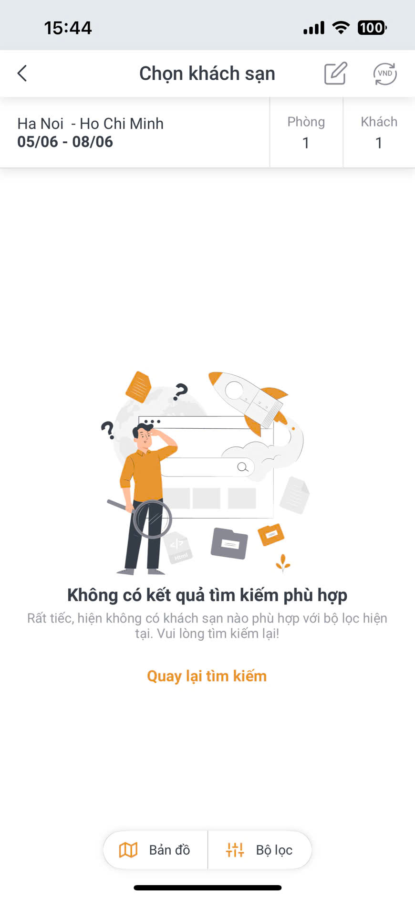
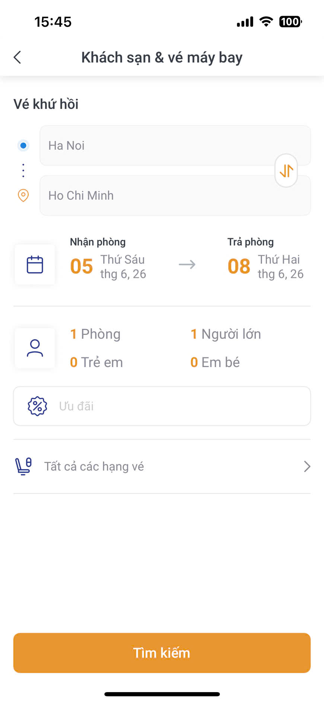
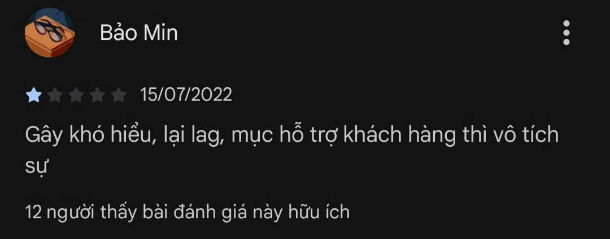
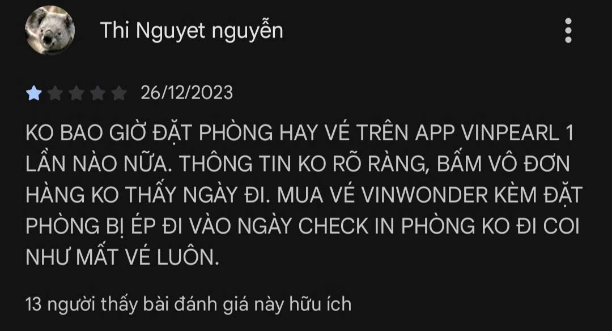
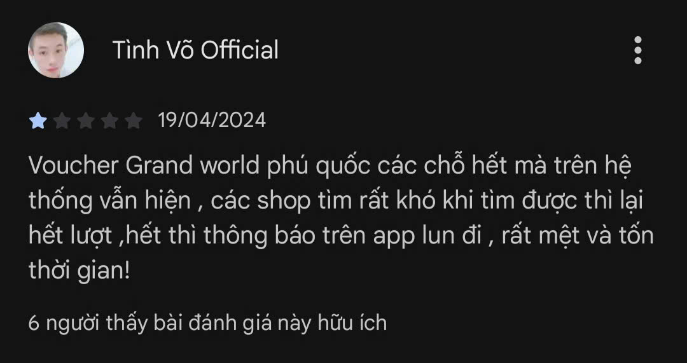

# Evidence Pack

Nộp kèm thin SPEC cuối Day 05.

## 1. Nhóm và track

**Tên nhóm:** Nhóm 007  

**Track:** B - Travel & Hospitality

**Product/app đã chọn:** MyVinpearl

**Build slice đang nghĩ:** Đặt phòng/vé máy bay + Xử lý đổi hủy

## 2. Self-use evidence

Nhóm tự dùng app/workflow và ghi lại điểm gãy.

| Observation | Screenshot/link | Path liên quan | Điều học được |
|---|---|---|---|
| User tìm khách sạn Hà Nội → HCM ngày 05/06–08/06, 1 phòng 1 khách. App hiển thị màn hình "Chọn khách sạn" nhưng trả về "Không có kết quả tìm kiếm phù hợp" kèm nút "Quay lại tìm kiếm" — không có gợi ý thay thế, không giải thích lý do, không có fallback. |  | Failure Path | Khi không có kết quả, hệ thống chỉ báo lỗi mà không gợi ý thay thế (nới lỏng bộ lọc, thay đổi ngày, đề xuất khách sạn gần nhất). User bị dead-end hoàn toàn. |
| Để tìm kiếm combo vé máy bay + khách sạn (Hà Nội → HCM, 05–08 tháng 6/2026), user phải nhập thủ công từng trường riêng lẻ: điểm đi, điểm đến, ngày nhận phòng, ngày trả phòng, số phòng, số người lớn, trẻ em, em bé, hạng vé. Không có AI hỗ trợ trích xuất thông tin từ câu tự nhiên.  |  | Low-confidence / Happy Path (manual) | Toàn bộ việc trích xuất intent (địa điểm, ngày, số người) đang đổ lên vai user. Nếu AI tự parse câu "Tìm combo vé + phòng Hà Nội đi HCM 5 đến 8 tháng 6, 1 người" và tự điền form, bước này sẽ biến mất. |

## 3. User / review / social evidence

Nguồn: Đánh giá thực tế trên App Store — màn hình "Xếp hạng & nhận xét".

| Quote / review / observation | Nguồn | User là ai? | Pain/failure mode | Screenshot |
|---|---|---|---|---|
| "Gây khó hiểu, lạị lag, mục hỗ trợ khách hàng thì vô tích sự" — review ★☆☆☆☆ | App Store · Báo Min | User phổ thông | UX/Performance failure: App khó dùng, lag, hỗ trợ không hiệu quả |  |
| "KO BAO GIỜ ĐẶT PHÒNG HẠY VÉ TRÊN APP VINPEARL 1 LẦN NÀO NỮA. THÔNG TIN KO RÕ RẰNG, BẦM VÔ ĐƠN HÀNG KO THẤY NGÀY ĐI. MUA VÉ VINWONDER KĘM ĐẶT PHÒNG BỊ ÉP ĐI VÀO NGÀY CHECK IN PHÒNG KO ĐI CÒI NHƯ MẤT VỀ LUÔN." — review ★☆☆☆☆ | App Store · Thi Nguyễn | User đặt phòng + vé tích hợp | Booking inconsistency: Thông tin đơn hàng không rõ ràng, check-in bị ép ngày không khớp |  |
| "Voucher Grand world phủ quốc các chô hết mà trên hệ thống vẫn hiện, các shop tìm rất khó khi tìm được thì lại hết lượt, hết thời gian!" — review ★☆☆☆☆ | App Store · Tình Võ Official | User sử dụng voucher | Inventory/Promotion failure: Voucher hiển thị nhưng không available, hết lượt nhanh chóng |  |

## 4. Competitor / analog evidence

"Đặt phòng/vé máy bay + Xử lý đổi hủy phòng và giải thích chính sách hoàn trả"

| App / mô hình tham khảo                     | Họ xử lý task này thế nào?                                                                                                                                                                                                                                          | Pattern học được                                                                                                                                                    | Có áp dụng trong 1 ngày không?                                            |
| ------------------------------------------- | ------------------------------------------------------------------------------------------------------------------------------------------------------------------------------------------------------------------------------------------------------------------- | ------------------------------------------------------------------------------------------------------------------------------------------------------------------- | ------------------------------------------------------------------------- |
| Expedia AI (ChatGPT integration)            | Chat + Action cards (nút "Book on Expedia", xem chuyến); gọi tool tra cứu pricing & supply data real-time; Happy path: gợi ý → click book; Low-confidence: hỏi clarifying questions (địa điểm, ngày, ngân sách); Failure: chuyển human agent + tóm tắt 30+ ngôn ngữ | Augmented decision (AI gợi ý, user click book); Action cards UI; Clarification questions khi low-confidence; Human escalation khi complex customerexperiencedive+2  | Có — UI action cards + prompt clarification + mock data linkedin          |
| Airbnb Support Bot                          | Chat + Action cards (nút "Cancel reservation", "Request refund"); gọi tool tra cứu reservation/account người dùng; Happy path: AI nhận diện hủy → action card → tự động xử lý; Low-confidence: hỏi lại + 2-3 lựa chọn action; Failure: đề xuất nói với người thật   | Hybrid decision (AI tự động routine, escalates complex); Action cards cho đổi/hủy; Human escalation pattern; Dẫn link Help Center article yourstory+2               | Có — Action cards + escalation pattern + prompt yourstory+1               |
| Booking.com AI (Smart Filter, Property Q&A) | Chat + Smart Filter UI (lọc giá, tiện ích); gọi tool tóm tắt review/policy; Happy path: AI tóm tắt → user click book; Low-confidence: đề xuất filter hẹp lại; Failure: routing đến human agent                                                                      | Augmented decision (AI gợi ý, user quyết định); UI filter cho clarification; Review summaries customerexperiencedive+1                                              | Có — UI filter + review summary prompt news.booking                       |
| Hopper HT Assist (AI travel agent)          | Chat thuần + nút "my trips/contact support"; gọi tool tra cứu bookings/modifications; Happy path: AI đề xuất rebook/refund → user click xác nhận; Low-confidence: hỏi lại loại phòng, ngày tháng; Failure: escalates human support                                  | Hybrid decision (AI xử lý rebook/refund cơ bản); Chat + confirmation buttons; Human escalation fastcompany                                                          | Có — Chat + nút xác nhận + mock data fastcompany                          |
| Perplexity AI (travel policy queries)       | Chat thuần + inline citations (hover preview source cards); gọi tool browsing/real-time Search; Happy path: trả lời + citations ngay; Low-confidence: đề xuất follow-up prompts; Failure: hiển thị "Browsing sources..." + báo không tìm thấy                       | Citations/Sources LUÔN C三更 (tránh hallucination); Showing work (hiển thị "Đang tra cứu..."); Follow-up prompts cho clarification; User tự kiểm tra nguồn linkedin+1 | Có — Inline citations + follow-up prompts + prompt engineering linkedin+1 |
| Google AI Flight Deals (Search)             | Chat + visual cards (hiển thị flight deals); gọi tool AI display bargains; Happy path: user mô tả → AI hiển thị deal → book; Low-confidence: hỏi nơi/khi nào/ngân sách; Failure: routing đến Google Travel                                                          | Visual cards UI; Clarification questions (where, when, budget); Augmented decision techcrunch+2                                                                     | Có — Visual cards + clarification prompt techcrunch                       |
| Traveloka AI Chatbot / Kayak Chat       | Khi nhận câu hỏi tự nhiên, chatbot tự động trích xuất: Nơi đi, nơi đến, ngày đi, số khách. Sau đó render trực tiếp một danh sách các chuyến bay/khách sạn dưới dạng thẻ (Cards) trực quan ngay trong khung chat để user nhấn chọn và thanh toán.                    | **Hybrid UI / Card List Component**: Không hiển thị text thuần mà dùng các khối giao diện (UI Cards) sinh động có ảnh, giá, rating.                                 | **Có**: Tạo component UI động hiển thị danh sách phòng/vé dạng thẻ dựa trên các tham số AI trích xuất được từ câu chat của user.    |

---

## 5. Evidence → Insight

Evidence nổi bật nhất:

- User phải nhập nhiều trường thông tin riêng lẻ khi tìm kiếm phòng khách sạn hoặc vé máy bay.
- Khi không có kết quả, hệ thống chỉ báo lỗi mà không giải thích nguyên nhân hoặc gợi ý phương án thay thế.
- Các review cho thấy người dùng thường không hiểu thông tin booking, điều kiện sử dụng, hoặc chính sách đổi/hủy sau khi đặt.

Insight:

Người dùng không muốn phải nhớ quy trình đặt dịch vụ du lịch phức tạp với nhiều trường dữ liệu khác nhau.

Họ muốn mô tả nhu cầu bằng ngôn ngữ tự nhiên như đang nói chuyện với nhân viên tư vấn:

"Tôi muốn đi Phú Quốc 3 ngày 2 đêm vào cuối tuần tới."
"Cho tôi đổi ngày check-in sang thứ Bảy."
"Nếu tôi hủy bây giờ thì có mất phí không?"

Vấn đề không chỉ là tìm kiếm phòng/vé, mà là người dùng phải tự hiểu quy trình đặt chỗ và tự đọc các chính sách đổi/hủy phức tạp.

Opportunity:

AI Agent có thể trở thành một lớp giao tiếp tự nhiên giữa người dùng và hệ thống booking:

1. Tự động trích xuất thông tin từ câu chat (địa điểm, ngày đi, số khách).
2. Hiển thị các lựa chọn phòng/vé dưới dạng Rich UI Cards.
3. Giải thích chính sách đổi/hủy bằng ngôn ngữ đơn giản.
4. Hướng dẫn các bước đổi/hủy phù hợp với từng trường hợp.
5. Khi thiếu thông tin, Agent chủ động hỏi lại thay vì báo lỗi.

Nhờ đó người dùng không cần thao tác qua nhiều màn hình và không phải tự đọc các điều khoản dài dòng.

---

## 6. Evidence đổi SPEC như thế nào?

### Checklist

- [ ] Đổi user chính.
- [x] Đổi pain statement.
- [x] Đổi build slice.
- [x] Đổi Auto/Aug decision.
- [x] Đổi 4 paths.
- [x] Đổi failure mode.
- [ ] Đổi owner/test plan.

### Thay đổi quan trọng

Trước evidence, nhóm định xây dựng chatbot tư vấn du lịch tổng quát (hỏi đáp thông tin điểm đến, khách sạn, dịch vụ).

Sau evidence, nhóm thu hẹp build slice thành:

"AI Booking Assistant hỗ trợ:
(1) tìm kiếm phòng khách sạn/vé máy bay bằng ngôn ngữ tự nhiên;
(2) giải thích chính sách đổi/hủy;
(3) hướng dẫn xử lý yêu cầu đổi/hủy booking."

Lý do:

Các bằng chứng thu thập được cho thấy điểm gãy xuất hiện ngay trong hành trình booking và post-booking. Người dùng gặp khó khăn khi nhập nhiều thông tin tìm kiếm, không được hỗ trợ khi tìm kiếm thất bại, đồng thời thường không hiểu điều kiện đổi/hủy hoặc hoàn tiền.

Đây là một workflow rõ ràng, có thể mô phỏng bằng AI Agent trong phạm vi 1 ngày phát triển thông qua dữ liệu booking và chính sách mẫu, không cần tích hợp hệ thống vận hành thực tế.